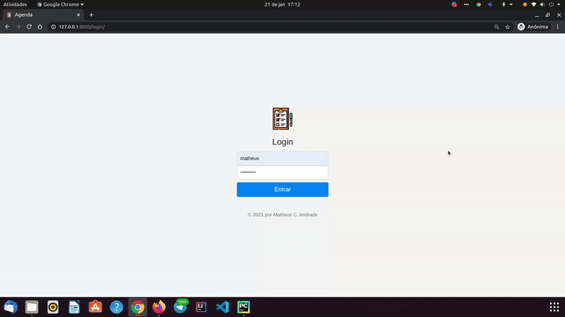

<h1 align="center">
:small_red_triangle_down: Agenda: To-do List with Django
</h1>

<h2 align="center">
A To-do webapp which does login; it adds new tasks, edit or remove them; it shows the past tasks.
</h2>

  

### :books: Learning

  - How to develop a webpage's backend in Python with Django from DIO's course.
  - Better understanding of HTML and CSS.
  - How to use bootstrap with Django.
  - How to manipulate static files with Django.

 

### :small_orange_diamond: Customizing
  The original project had just the backend, so I created:
  1. Answers of the last activity: next events in 1h turned in green; 404 return covering all URLs; new event history view. 
  2. Template for all the pages (login, agenda, historico);
 

### Useful links  
[Teacher's github contains more details](https://github.com/rafegal/agenda)  
